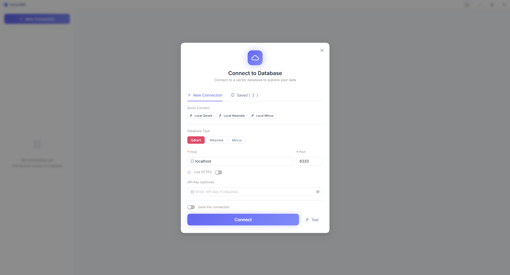
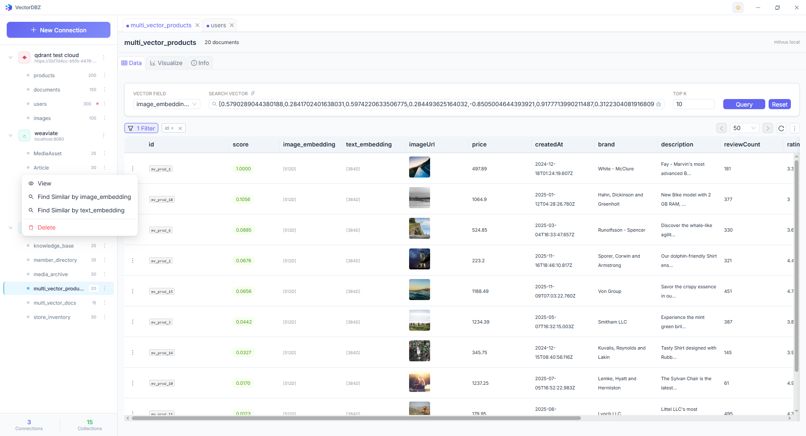
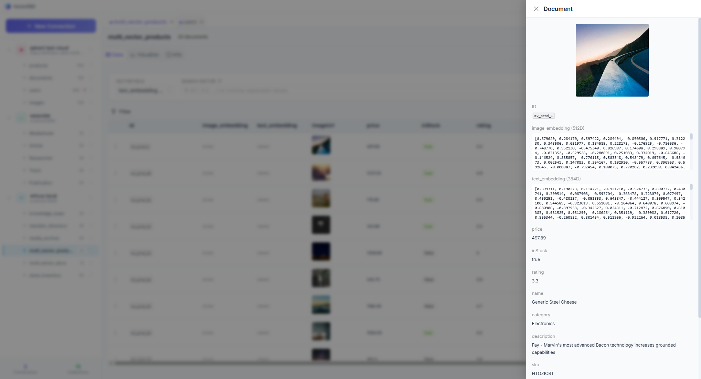
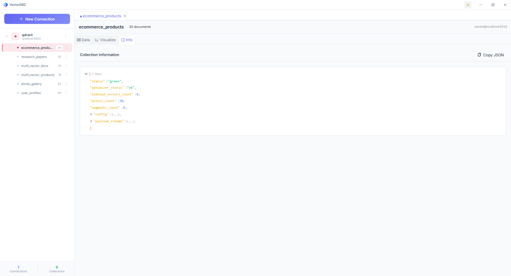
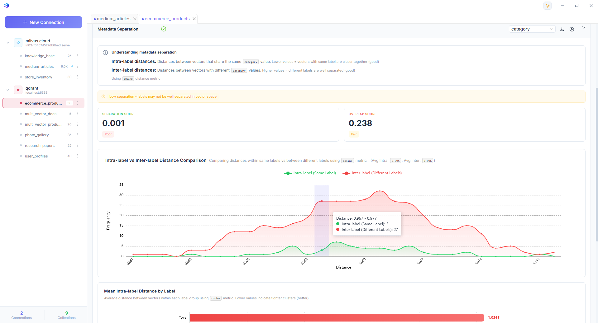
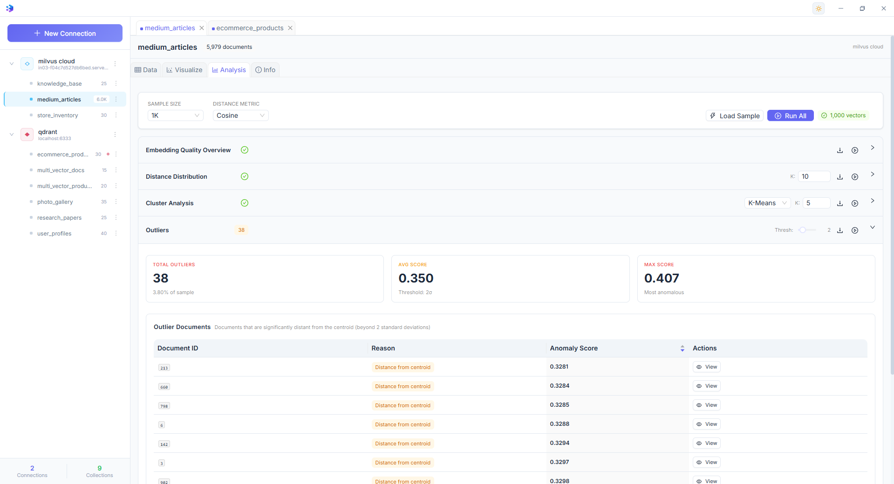

<p align="center">
  
</p>

<h1 align="center">VectorDBZ</h1>

<p align="center">
  <strong>A modern desktop GUI for exploring and managing vector databases</strong>
</p>

<p align="center">
  <a href="#supported-databases">Databases</a> •
  <a href="#features">Features</a> •
  <a href="#screenshots">Screenshots</a> •
  <a href="#installation">Installation</a> •
  <a href="#feedback">Feedback</a>
</p>

## 💬 We Want Your Feedback!

This is an early release meant to gather feedback and understand what the community needs. If you have any suggestions, feature requests, bug reports, or general feedback, I would be thrilled to hear from you! 

Please open an [issue](https://github.com/vectordbz/vectordbz/issues) or start a [discussion](https://github.com/vectordbz/vectordbz/discussions).

---

## Supported Databases

| Database | Status | Version Tested |
|----------|--------|----------------|
| **Qdrant** | ✅ Fully Supported | v1.7+ |
| **Weaviate** | ✅ Fully Supported | v1.19+ |
| **Milvus** | ✅ Fully Supported | v2.3+ |
| **ChromaDB** | ✅ Fully Supported | v0.4+ |

---

## Features

### 🔌 Connection Management
- **Multiple Connections** — Connect to multiple databases simultaneously
- **Saved Connections** — Save and organize your database connections locally
- **Connection Testing** — Verify connectivity before establishing connections
- **Secure** — Support for API keys and HTTPS connections

### 📊 Data Explorer
- **Browse Collections** — View all collections with document counts
- **Paginated Data View** — Navigate through large datasets with forward/backward pagination
- **Document Details** — Inspect full document payloads and vector data
- **Dynamic Columns** — Automatically detect and display payload fields

### 🔍 Search & Filter
- **Vector Search** — Find similar vectors using sample documents
- **Filter Builder** — Build complex filters with AND/OR logic
- **Multiple Operators** — Support for equals, contains, greater than, less than, and more
- **Multi-Vector Support** — Search across collections with named vectors

### 📈 Visualize
- **2D/3D Scatter Plots** — Visualize vector embeddings in reduced dimensions
- **Dimensionality Reduction** — PCA, t-SNE, and UMAP algorithms
- **Interactive Charts** — Zoom, pan, and hover for details
- **Color by Field** — Color-code points by payload values
- **Export** — Download visualizations as PNG images

### 🛠️ Collection Management
- **Collection Info** — View detailed collection configuration and statistics
- **Drop Collection** — Delete collections with confirmation
- **Truncate Collection** — Clear all documents while preserving schema
- **Delete Documents** — Remove individual documents or filter-based batch deletion

### 📊 Analysis & Quality Metrics
- **Embedding Quality Overview** — Analyze vector quality with dimensionality, norm distribution, and distance metrics
- **Distance Distribution** — Compare k-nearest neighbor distances vs random pairs
- **Cluster Analysis** — Perform K-Means or DBSCAN clustering with silhouette scores
- **Metadata Separation** — Evaluate how well metadata labels are separated in vector space
- **Outlier Detection** — Identify anomalous documents using statistical methods
- **Duplicate Detection** — Find near-duplicate vectors with configurable similarity thresholds
- **Embedding Comparison** — Compare multiple vector fields using rank correlation and neighbor overlap
- **Multiple Distance Metrics** — Support for cosine, euclidean, and dot product distances
- **Interactive Charts** — Visualize analysis results with beautiful, responsive charts

### 🎨 User Experience
- **Dark/Light Themes** — Switch between dark and light modes
- **Multi-Tab Interface** — Open multiple collections in separate tabs
- **Responsive Layout** — Collapsible sidebar for more workspace
- **Cross-Platform** — Windows, macOS, and Linux support

---

## Screenshots

### Connection Modal
Connect to your vector database with support for multiple database types, custom hosts, and secure connections.



### Data Tab
Browse and search through your vector data with pagination, filtering, and document inspection.



### Document View
Inspect full document details including payload fields and vector embeddings.



### Visualize Tab
Explore your vector space with interactive 2D/3D visualizations using PCA, t-SNE, or UMAP.


### Collection Info Tab
View detailed information about your collection's configuration, indexing, and statistics.



### Analysis Tab
Comprehensive vector analysis tools to evaluate embedding quality, detect outliers, find duplicates, and compare different vector fields.

#### Embedding Quality Overview
Analyze vector quality metrics including dimensionality, norm distribution, and distance statistics.


#### Metadata Separation Analysis
Evaluate how well different metadata labels are separated in vector space with interactive visualizations.



#### Outlier Detection
Identify anomalous documents that are significantly distant from the centroid.



---

## Installation

Download the latest release for your platform from the [Releases](https://github.com/vectordbz/vectordbz/releases) page.

| Platform | Download |
|----------|----------|
| Windows | `VectorDBZ-x.x.x-Setup.exe` |
| macOS (Intel) | `VectorDBZ-darwin-x64-x.x.x.zip` |
| macOS (Apple Silicon) | `VectorDBZ-darwin-arm64-x.x.x.zip` |
| Linux | `vectordbz_x.x.x_amd64.deb` or `.rpm` |

### macOS Installation Note

The macOS app is not code-signed (requires Apple Developer account). After downloading:

1. Extract the `.zip` file
2. Move `VectorDBZ.app` to your Applications folder
3. **First launch**: Right-click → "Open" → Click "Open" in the dialog

If you see **"VectorDBZ is damaged"** error, open Terminal and run:

```bash
xattr -cr /Applications/VectorDBZ.app
```

Then try opening the app again.

---

## Feedback

**Your feedback is incredibly valuable!** This project is in active development and I'm looking to make it as useful as possible for the vector databases community.

### Get in Touch

- 🐛 **Bug Reports** — Found something broken? [Open an issue](https://github.com/vectordbz/vectordbz/issues/new?labels=bug)
- 💡 **Feature Requests** — Have an idea? [Start a discussion](https://github.com/vectordbz/vectordbz/discussions/new?category=ideas)
- 🗣️ **General Feedback** — Any thoughts or suggestions are welcome!

### Questions I'd Love Your Input On

- Which vector databases should be prioritized next?
- What features are missing that you need?
- How can the visualization tools be more useful?
- What's your workflow with vector databases that this tool could help with?

---

<p align="center">
  Made with ❤️ for the vector databases community
</p>

