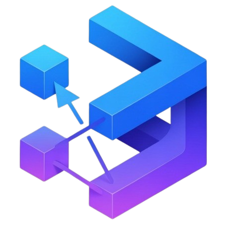

<p align="center">
  
</p>

<h1 align="center">VectorDBZ</h1>

<p align="center">
  <strong>Open-source desktop client for vector databases</strong>
</p>

<p align="center">
  
</p>

<p align="center">
  <a href="https://github.com/vectordbz/vectordbz/releases/latest"></a>
  <a href="LICENSE"></a>
  <a href="CONTRIBUTING.md"></a>
</p>

VectorDBZ lets you connect to local or cloud vector database instances, explore collections, run vector and hybrid searches, and visualize embeddings in 2D/3D — all from a native desktop app, no infrastructure required.

---

## Supported Databases

| Database | Minimum Version |
|:--------:|:---------------:|
| **Qdrant** | `v1.7+` |
| **Weaviate** | `v1.19+` |
| **Milvus** | `v2.3+` |
| **ChromaDB** | `v0.4+` |
| **Pinecone** | Latest |
| **pgvector (PostgreSQL)** | `PostgreSQL 11+` with `pgvector` extension |
| **Elasticsearch** | `v8.x` |
| **RedisSearch (Redis Stack)** | `v2.0+` |

---

## Installation

**[Download the latest release →](https://github.com/vectordbz/vectordbz/releases/latest)**

| Platform | Package |
|----------|---------|
| **Windows** | `.exe` installer (Windows 10+) |
| **macOS** Intel | `darwin-x64` zip (macOS 10.15+) |
| **macOS** Apple Silicon | `darwin-arm64` zip (macOS 10.15+) |
| **Linux** | `.deb` or `.rpm` (Ubuntu 18.04+, Fedora 32+) |

### macOS Note

The app is not code-signed. On first launch, right-click → **Open** → click **Open** in the dialog.

If you see **"VectorDBZ is damaged"**, run:

```bash
xattr -cr /Applications/VectorDBZ.app
```

---

## Development

See **[docs/DEVELOPMENT.md](docs/DEVELOPMENT.md)** for the full setup guide — prerequisites, running the app locally, seeding test data, and available scripts.

Quick start:

```bash
git clone https://github.com/vectordbz/vectordbz.git
cd vectordbz/app
npm ci
npm run start
```

---

## Contributing

Contributions are welcome — new database integrations, bug fixes, and feature improvements.

- Read [CONTRIBUTING.md](CONTRIBUTING.md) to get started
- Use the [step-by-step guide](docs/ADDING_A_DATABASE.md) to add a new database integration
- Browse [open issues](https://github.com/vectordbz/vectordbz/issues)
- [Open an issue](https://github.com/vectordbz/vectordbz/issues/new/choose) before starting large changes

---

## Support

- **Issues & Questions** — [GitHub Issues](https://github.com/vectordbz/vectordbz/issues)
- **Release Notes** — [GitHub Releases](https://github.com/vectordbz/vectordbz/releases)
